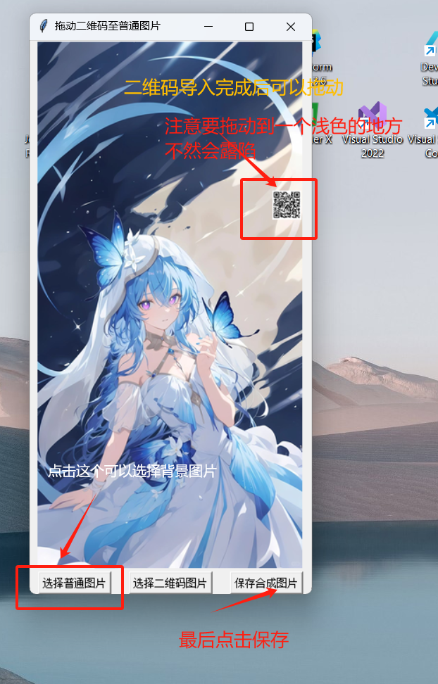

# pic_hide_barcode
*用于在微信中把图片隐藏到图片中*（美化二维码）

## 注意事项（必看）：

- **此软件只适用于美化微信中的二维码，在qq，相册（不清楚全部的手机），等其他软件中不适用**

- **拖拖动文件的时候必须要放在一个颜色浅的地方**

- **朋友圈中不能用，因为大可爱微信会压缩文件，透明度会被压没**

- **发微信的时候要用原图（png可以，jpg不行）**

## 使用教程：

双击dist文件夹下的exe文件

